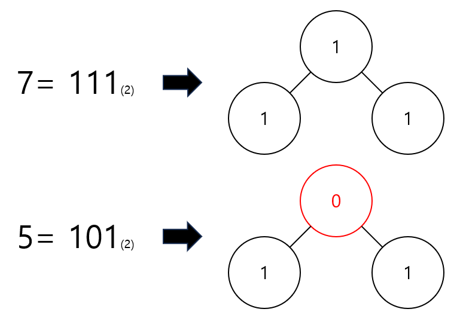

import BackgroundText from '@content/components/BackgroundText'
import TestInfo from './components/TestInfo'

<TestInfo url='https://school.programmers.co.kr/learn/courses/30/lessons/150367' level={3} solved={true}></TestInfo>

# 문제 분석

1. 이진수를 저장할 빈 문자열을 생성한다.
2. 주어진 이진트리에 더미 노드를 추가하여 포화 이진트리로 만듭니다.
<BackgroundText>루트 노드는 그대로 유지합니다.</BackgroundText>
3. 만들어진 포화 이진트리의 노드들을 가장 왼쪽 노드부터 가장 오른쪽 노드까지, 왼쪽에 있는 순서대로 살펴봅니다. 
<BackgroundText>노드의 높이는 살펴보는 순서에 영향을 끼치지 않습니다.</BackgroundText>
4. 살펴본 노드가 더미 노드라면 0, 더미 노드가 아니라면 1을 문자열 뒤에 추가합니다.
5. 문자열에 저장된 이진수를 십진수로 변환합니다.

이 문제는 위와 같은 방식으로 입력받은 수를 표현할 수 있는지 없는지 확인하는 문제에요.  
사실 말이 저렇게 되어 있지만 예시를 보면 더 이해가 쉽더라구요.



7은 이진수로 변환하면 111이 되어요.
이를 노드가 세개인 이진 트리로 표현할 수 있죠.

5는 이진수로 변환하면 101이 되어요.
이를 노드가 세개인 이진 트리로 표현하면 루트 노드가 더미가 되어야 해요.
하지만 그렇다면 하위 노드들을 가질 수 없죠.
모순이 되기 때문에 이진 트리로 표현할 수 없다 False 를 놓으면 됩니다.

즉 간단하게 생각하면 더미가 되는 노드가 하위 노드를 가지게 되는지 아닌지 판단만 하면 되는 문제에요.

# 풀이

문제는 이진 트리에서 왼쪽 노드부터 오른쪽 방향으로 순서대로 살펴 1과 0으로 이루어진 문자열을 만들어 냈어요.
그리고 이를 십진수로 변환하여 숫자로 만들어 냅니다.
우리는 반대로 숫자를 입력으로 받을 거예요.
그래서 이진수로 변환하여 배열을 만든 후 이를 통해 이진 트리를 만들어 낼 것입니다.
그리고 이 이진 트리를 검사하는 방향으로 가도록 하죠.

먼저 숫자를 이진수로 변환한 후 이진 트리를 나타내는 배열로 생성하는 코드를 짜보도록 하죠.
```python
def create_bin_tree_arr(number):
    # create stack
    stack = []
    i = 1
    while number // 2 > 0:
        stack.append(number%2)
        number = number // 2
        i += 1
    stack.append(number%2)

    unit = 0
    while i >= 2**unit:
        unit += 1

    # create binary list
    arr = []
    # add prefix
    for _ in range(2**(unit)-1 - len(stack)):
        arr.append(0)
    # stack to list
    while len(stack) > 0:
        arr.append(stack.pop())

    return arr
```

간단하게 이진 트리를 나타내는 배열로 만들 수 있네요.
이제 우리는 더미 노드가 하위 노드를 가지는지 검사를 진행하면 됩니다.
이진 트리 형태의 배열은 1, 3, 7, 15, ..., $2^n - 1$ 크기의 사이즈를 가지고 있어요.
이중 루트 노드는 배열의 중앙에 위치합니다.
배열 중앙을 기준으로 왼쪽, 오른쪽은 각각 하위 노드들이 되는 거죠.
또 하위 노드들의 중앙은 하위 루트가 되는 거죠.
이를 이용하여 우리는 루트 노드와 하위 노드들을 검사하고, 하위 노드가 존재하는데 루트가 더미인 사실만 조사하면 됩니다.

```python
def is_valid(arr):
    if len(arr) <= 1:
        return True
    
    center_index = len(arr) // 2
    left_arr = arr[:center_index]
    right_arr = arr[center_index+1:]
    has_child = sum(left_arr) > 0 or sum(right_arr) > 0
    if has_child and arr[center_index] == 0:
        return False
    
    return True and is_valid(left_arr) and is_valid(right_arr)
```

이제 필요한 코드는 모두 완성한 것 같네요.
solution 함수에 배열을 만들고 검사하는 코드만 추가하면 완성입니다.

```python
def solution(numbers):
    answer = []
    
    for number in numbers:
        bin_tree_arr = create_bin_tree_arr(number)
        answer.append(1 if is_valid(bin_tree_arr) else 0)
    return answer
```