## Corner
이미지에서 Corner를 찾는 방법은 아래와 같다
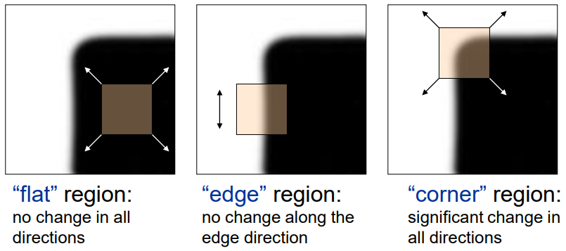
* 가장 왼쪽 그림과 같은 flat 구간에서 window를 어느 방향으로 움직여도 값의 큰 변화가 없다.
* 두번째 그림과 같은 edge 구간에서 window를 상하로 이동하면 큰 변화가 없고 좌우로 이동시 변화가 생긴다.
* 세번째 그림과 같은 corner 구간에서 window를 어느 방향으로 이동해도 변화가 생긴다.

## Taylor Series
수치 해석 시간에 배웠던 Taylor Series를 다시 기억해보자.
$$
f(x)=C_{0}+C_1(x-a)+C_2(x-a)^2+C_3(x-a)^3+...
$$
$$
f(a)=C_0, f'(a)=C_1, f''(a)=2\cdot C_2, f'''(a)=2\cdot 3\cdot C_3, C_n= \frac{{f}^{(n)}(a)}{n!}
$$
$$
f(x)=\frac{{f}^{(n)}(a)}{n!}\cdot (x-a)^n
$$
위 식은 x가 a근처에서만 성립하고, a의 범위는 f(x)에 따라 달라진다.
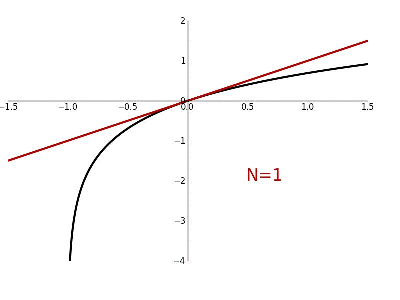

위는 $log(1+x)$의 그래프다. 
Taylor Series의 다항식 차수 N이 증가함에 따라 그래프에 점점 근사하는 것을 볼 수 있다. 
또한 $\left| x\right|\geq 1$인 구간에서 오차는 급격하게 증가한다.
따라서 $log(1+x)$ 함수는 $\left| x\right|< 1$인 경우에만 Taylor Series를 적용 가능하다.

위 식을 아래와 같이 약간 변형시켜보자.
$$
f(x_0+\Delta x)=\sum_{n=0}^{\infty }\frac{f^{(n)}(x_0)}{n!}\Delta x
$$
$x_0=a$이고 $\Delta x=(x-a)$로 약간 변형을 준 것이다. 이때 $\Delta x$는 0에 가까운 값이다.

기본적인 2차원 형태의 함수는 아래와 같이 표현할 수 있다.
$$
f(x_0+\Delta x,y_0+\Delta y), g(t)=f(x_0+t\Delta x,y_0+t\Delta y)
$$
$$
g(t)=f(x(t),y(t)), x(t)=x_0+\Delta x, y(t)=y_0+\Delta y
$$
위 식에 동일하게 Taylor Series를 적용하면 아래와 같다.
$$
f(x_0+\Delta x,y_0+\Delta y)=g(0)+g'(0)+\frac{1}{2}g''(0)+...=f(x_0,y_0)+f_x(x_0,y_0)\Delta x+f_y(x_0,y_0)\Delta y + ...
$$
## Harris Corner Detection
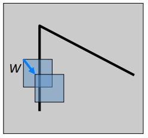

기준 위치 (x, y)에서 window가 sliding하며 변화한 픽셀값의 차이 ```SSD```(Summing up the Squared Differences) E를 아래와 같이 계산한다.
$$
E(u,v)=\sum_{(x,y)\in W}^{}(I(x+u,y+v)-I(x,y))^2
$$
모든 픽셀에 위 연산을 대해 수행해야 하는데 너무 큰 cost를 가지기에 N=1인 Taylor Series를 이용하여 근사값을 계산한다.
$$
I(x+u,y+v)\approx I(x,y)+I_x(x,y)u+I_y(x,y)v
$$
$$
E(u,v)\approx \sum_{(x,y)\in W}(I_x u+I_y v)^2\approx Au^2+2Buv+Cv^2
$$
$$
A=\sum_{(x,y)\in W}{I_x}^2, B=\sum_{(x,y)\in W}I_x I_y, C=\sum_{(x,y)\in W}{I_y}^2
$$
위 식을 정리하면 아래와 같이 표현할 수 있다.
$$
E(u,v)\approx
\begin{bmatrix}
u & v \\
\end{bmatrix}
M
\begin{bmatrix}
u \\ v
\end{bmatrix},
M = \begin{bmatrix}
A & B \\
B & C \\
\end{bmatrix} 
$$
여기서 M을 ```second moment matrix``` 또는 ```Harris matrix``` 라고 한다.
second moment matrix는 window의 변화에 따라 아래와 같은 특징이 있다.


위 사진과 같은 경계의 경우 window sliding에 따른 I의 x축 변화량은 0이기 떄문에 y축 변화에만 영향을 받는 그래프 형상이 나타난다.


위 사진과 같은 경계의 경우 window sliding에 따른 I의 y축 변화량은 0이기 때문에 y축 변화에만 영향을 받는 그래프 형상이 나타난다.
## Visualizing Quadratics


함수 $f(x,y)=x^2+y^2$는 위 그림과 같은 그릇 모양을 하는데 이를 ```Paraboloid```라고 한다.
이 Paraboloid를 $z=1$인 지점에서 xy평면으로 자른다면 $x^2+y^2=1$인 원의 방정식이 나온다.
이 $f(x,y)$를 
$
\begin{bmatrix}
x & y \\
\end{bmatrix}
\begin{bmatrix}
1 & 0 \\
0 & 1 \\
\end{bmatrix} 
\begin{bmatrix}
x \\ y
\end{bmatrix}
$ 와 같은 행렬의 형태로 표시할 수 있다.

위와 같은 방식으로 $f(x,y)=4x^2+y^2$인 xy평면으로 잘랐을 때 타원 방정식의 형태를 띄는 함수를
$
\begin{bmatrix}
x & y \\
\end{bmatrix}
\begin{bmatrix}
4 & 0 \\
0 & 1 \\
\end{bmatrix} 
\begin{bmatrix}
x \\ y
\end{bmatrix}
$ 와 같은 행렬의 형태로 표시할 수 있다.

가운데 행렬을 ```SVD```(Singular Value Decomposition)를 적용하여 eigenvector와 eigenvalue를 구할 수 있다.


이때 첫번째 행렬은 eigenvector이고 각각 타원을 이루는 축에 대한 정보를 가진다.
또한 가운데 행렬은 eigenvalue이고 각각 타원의 반지름에 대한 정보를 가진다.
조금 더 복잡한 타원 방정식을 SVD를 통해 기하학적으로 표현하면 아래와 같다.
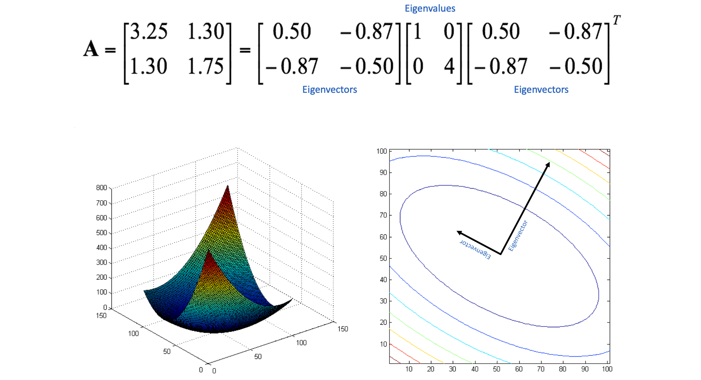

$
\begin{bmatrix}
0.50 \\
-0.87 \\
\end{bmatrix} 
$벡터를 축으로 하는 반지름은 1,
$
\begin{bmatrix}
-0.87 \\
-0.50 \\
\end{bmatrix} 
$벡터를 축으로 하는 반지름은 $\frac{1}{\sqrt{4}}$를 가지는 타원이 된다.

## Second Moment Matrix 해석


근사된 $E(u,v) \approx Au^2+2Buv+Cv^2$를 약간 변형하면 $A({u-a}^2)+C({v-b}^2)$로 타원 방정식 형태로 변형할 수 있다.
즉 $E(u,v)$는 수평하게 잘랐을 때 그 모양이 타원의 모습을 이룬다.

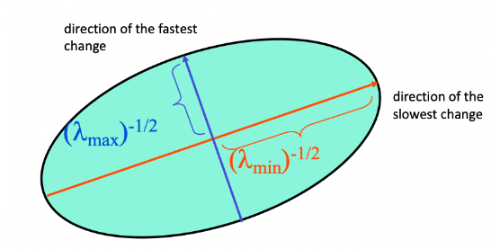

second moment matrix M을 SVD를 하면
$
M = R^-1
\begin{bmatrix}
\lambda_1 & 0 \\
0 & \lambda_2 \\
\end{bmatrix}
R
$
로 표현할 수 있고 eigenvalue를 통해 타원의 형태를 확인할 수 있다.


$\lambda_1$과 $\lambda_2$가 비슷하면서 0에 가까우면 flat, $\lambda_1$ 와 $\lambda_2$가 큰 차이가 나면 Egde, $\lambda_1$ 와 $\lambda_2$가 둘다 크면 Corner이다.

기본적인 방법으로 eigenvalue와 eigenvector를 구하는 방법을 생각해보자.
$Mx = \lambda x$이고 $(M-\lambda)x=0$가 되는 $\lambda_{min}$, $\lambda_{max}$, $x_{min}$, $x_{max}$를 찾는다.
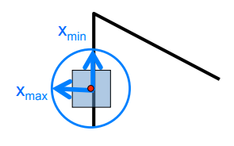

이때 M의 eigenvalue와 eigenvector는 아래와 같다
* $x_{max}$는 E를 급격하게 증가시키는 방향
* $\lambda_{max}$는 $x_{max}$방향에서 E의 증가량
* $x_{min}$는 E를 느리게 증가시키는 방향
* $\lambda_{min}$는 $x_{min}$방향에서 E의 증가량


위 그림에서 일정 값 이상의 $\lambda_{max}$를 표시한 부분은 모든 edge를 나타내고 있으며,
일정 값 이상의 $\lambda_{min}$를 표시한 부분은 corner를 나타내고 있다.
위와 같이 $\lambda_{min}$이 threshold값 이상을 가지는 모든 points를 찾는다.

## Harris operator
각 픽셀마다 $\lambda_{min}$를 구하는 것은 쉽지 않다.
따라서 Harris operator를 사용하여 $\lambda_{min}$의 근사값을 찾는다.
연산에는 많은 종류가 있찌만 그중 가장 유명한 Harris response는 아래와 같다.
$$
{\lambda_{min}}\approx f=\frac{\lambda_1\lambda_2}{(\lambda_1 + \lambda_2)}=\frac{det(M)}{trace(M)}
$$

## Corner Detection
마지막으로 Harris Corner Detection으로 feature를 찾는 방법은 다음과 같다.

1. 각 포인트마다 gradient를 계산한다.
2. $I_x$와 $I_y$를 계한하여 H행렬을 구성하고 threshold 이상의 $\lambda_{min}$들을 찾는다.
3. 찾은 $\lambda_{min}$중 local maximum인 부분을 feature로 선택한다.
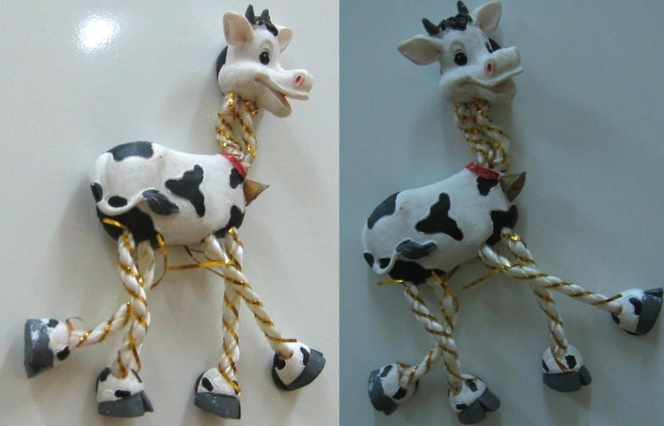
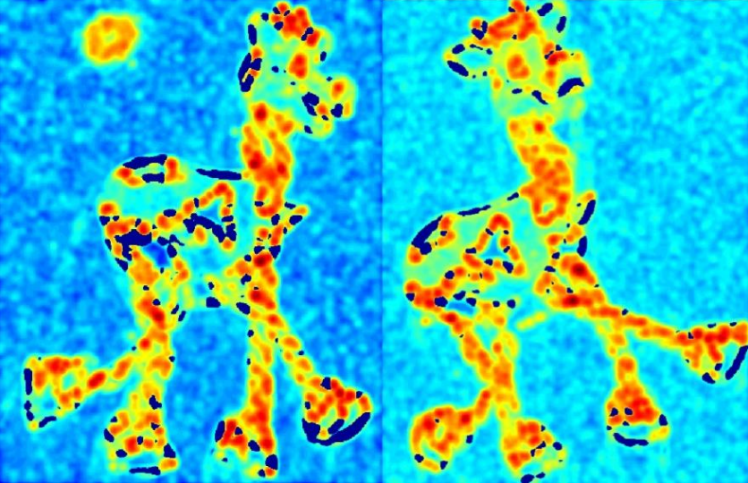
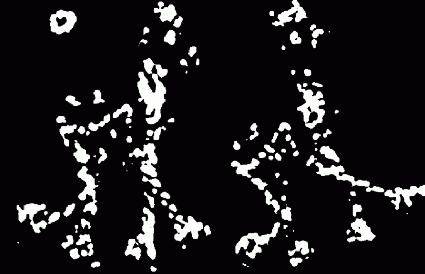
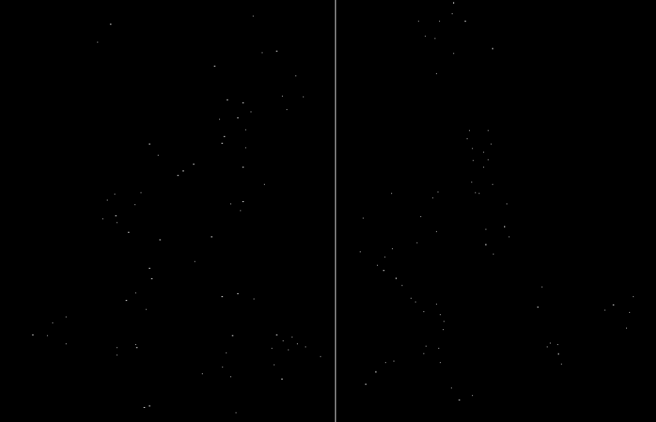

조금 더 성능을 향상시키기 위해 window내 모든 gradient를 동등하게 계산하는 것이 아닌 guassian과 같이 거리에 따라 가중치를 준다.
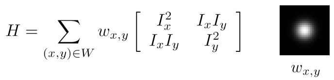

## Harris Detector 특징


타원의 방향(eigenvector)이 바뀌지만 모양(eigenvalue)은 유지되기 때문에 회전과 이동에 불변한다.

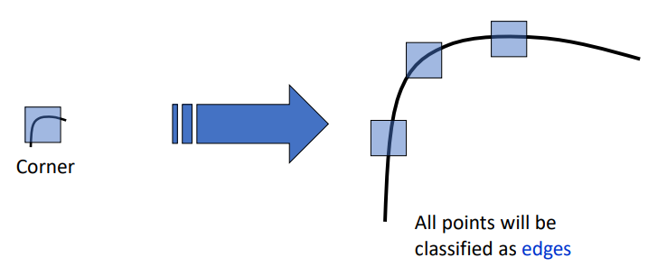

하지만 window크기에 따라 계산되기 때문에 scaling에는 영향을 받는다.