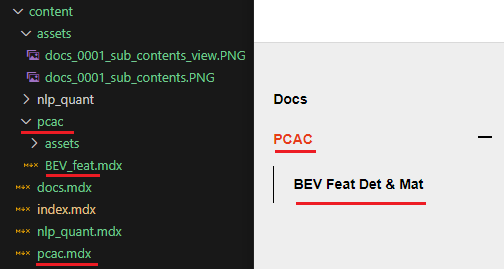

그 동안 프로젝트 진행에 급해 기록을 남기지 않았다. 지금부터라도 프로젝트를 진행하면서 개발방향과 진행상황을 기록하기 위한 Document를 개설한다.

### 프레임워크 선정
Point Cloud 데이터를 다루는 만큼 Potree를 통해 웹에서 시각화된 페이지를 만들 수 있게 React를 이용하여 아예 처음부터 제작하려 하였으나, 기록을 위한 용도라고 하기엔 배보다 배꼽이 더 커지는 상황이 될 것 같았다. 따라서 MDX파일 만으로 간단하게 콘텐츠를 추가할 수 있는 정적 페이지 생성 프레임워크를 선정하기로 하였다.

Jekyll, Hexo, Hugo, Gatsby 등 여러가지 종류가 있었는데, 그 중 Gatsby가 React 기반이라고 하여 선정하게 되었다.

### 템플릿
[Gatsby Theme Document]('https://github.com/codebushi/gatsby-theme-document-example') 템플릿을 사용하였다. 템플릿을 이용할 경우 Component들의 배치를 자유롭게 Customizing 할 수 없다는 단점이 존재하여 나중에 템플릿을 이용하지 않고 초기부터 직접 구현하도록 한다.

### 개발
```sh
$ gatsby develop
```
위 명령어를 이용하여 [http://localhost:8000]('http://localhost:8000')으로 수정이 발생할 시 Hot Reload 형식으로 개발을 진행할 수 있다.

### 배포
Github에 배포를 진행하기 위해 gh-pages 모듈을 사용하였다.
```sh
$ npm run deploy
```
위 명령어를 입력하여 Github gh-pages 브랜치로 자동으로 배포가 된다. URL은 [https://yeti-s.github.io]('https://yeti-s.github.io')

이때 Repository 이름을 '[github 계정].github.io'로 만들어야 해당 url로 입력하였을 때 바로 접속할 수 있다.


### Contents 추가
기본적으로 Contents는 content 폴더에 .mdx 파일 형식으로 작성한다.
이 때 파일의 가장 첫 부분은 아래와 같은 형식을 띄어야 한다.
```
---
title: 'PCAC'
description: 'Point Cloud Auto Correction'
---
```
작성하고자 하는 내용이 많아 Sub Contents의 형식으로 추가하려고 할 때, 해당하는 .mdx 파일의 파일 이름과 동일한 폴더를 생성한 후 추가할 내용을 가진 .mdx 파일을 생성한다.



### 수식 추가
공부 내용을 정리하다 보면 수식을 사용할 일이 많을 것이라 예상이된다.
그래서 수식을 표현할 수 있는 Package를 추가한다.
먼저 아래 3가지 Package를 설치하자
```sh
$ npm install i remark-math@3.0.1 rehype-katex@5.0.0 katex --force
```
gatsby-theme-document에서는 dependency로 gatsby-plugin-mdx를 가진다.
gatsby-plugin-mdx는 내부적으로 remark version 10을 사용하고 있는데 remark-math vesion 4부터는 remark version 13을 필요로 하기 떄문에 version 3으로 설치한다.

gatsby-theme-document 모듈 내부 gatsby-config.js에 plugin으로 추가를 해주자.
```js
// gatsby-config.js
module.exports = {
    ...
    plugins: [
        {
            resolve: 'gatsby-plugin-mdx',
            options: {
                ...
                remarkPlugins: [require('remark-math')],
                rehypePlugins: [require('rehype-katex')]
            }
        }
    ]
}
```
또한 css를 template에 import 해주면 작업은 완료된다
```js
//docs.js
import 'katex/dist/katex.min.css'
```

아래와 같은 방식으로 수식을 표현할 수 있다.
```
$$
S_n = \frac{n(2a + (n-1)d)}{2}
$$
```
$$
S_n = \frac{n(2a + (n-1)d)}{2}
$$