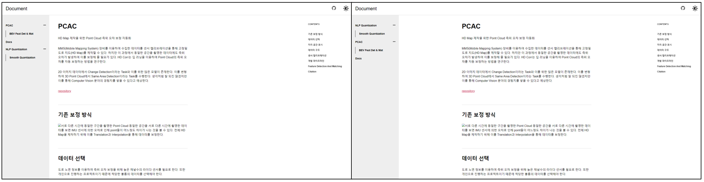

그 동안 프로젝트 진행에 급해 기록을 남기지 않았다. 지금부터라도 프로젝트를 진행하면서 개발방향과 진행상황을 기록하기 위한 Document를 개설한다.

### 프레임워크 선정
Point Cloud 데이터를 다루는 만큼 Potree를 통해 웹에서 시각화된 페이지를 만들 수 있게 React를 이용하여 아예 처음부터 제작하려 하였으나, 기록을 위한 용도라고 하기엔 배보다 배꼽이 더 커지는 상황이 될 것 같았다. 따라서 MDX파일 만으로 간단하게 콘텐츠를 추가할 수 있는 정적 페이지 생성 프레임워크를 선정하기로 하였다.

Jekyll, Hexo, Hugo, Gatsby 등 여러가지 종류가 있었는데, 그 중 Gatsby가 React 기반이라고 하여 선정하게 되었다.

### 템플릿
[Gatsby Theme Document]('https://github.com/codebushi/gatsby-theme-document-example') 템플릿을 사용하였다. 템플릿을 이용할 경우 Component들의 배치를 자유롭게 Customizing 할 수 없다는 단점이 존재하여 나중에 템플릿을 이용하지 않고 초기부터 직접 구현하도록 한다.

### 개발
```sh
$ gatsby develop
```
위 명령어를 이용하여 [http://localhost:8000]('http://localhost:8000')으로 수정이 발생할 시 Hot Reload 형식으로 개발을 진행할 수 있다.

### 배포
Github에 배포를 진행하기 위해 gh-pages 패키지를 사용하였다.
```sh
$ npm run deploy
```
위 명령어를 입력하여 Github gh-pages 브랜치로 자동으로 배포가 된다. URL은 [https://yeti-s.github.io]('https://yeti-s.github.io')

이때 Repository 이름을 '[github 계정].github.io'로 만들어야 해당 url로 입력하였을 때 바로 접속할 수 있다.


### 콘텐츠 작성 규칙
콘텐츠는 content 폴더에 .mdx 파일 형식으로 작성한다.  
이 때 파일의 가장 첫 부분은 아래와 같은 형식을 띄어야 한다.
```
---
title: 'PCAC'
description: 'Point Cloud Auto Correction'
---
```
content를 추가하기 위해 폴더를 생성하고 index.mdx 파일을 생성하여 내용을 작성한다.  
해당 폴더내에 추가로 {sub_file}.mdx파일을 생성할 경우 하나의 카테고리로 묶여 좌측 사이드바에 표시된다.  
사용되는 정적파일의 경우 해당 폴더에 assets/{file_name} 폴더를 생성하고 00 ~ 99 까지 넘버링으로 저장한다.
```
|-- content
    |-- index.mdx
    |-- docs
    |   |-- index.mdx
    |   |-- sub_file1.mdx
    |   |-- assets
    |       |-- index
    |           |-- 00.png
    |           |-- 01.png
    |       |-- sub_file1
    |           |-- 00.png
    |-- cv
    |   |-- index.mdx
    |   |-- sub_file2.mdx
    |   |-- assets
    |       |-- index
    |           |-- 00.png
    |       |-- sub_file2
    |           |-- 00.png
```


### 수식 추가
공부 내용을 정리하다 보면 수식을 사용할 일이 많을 것이라 예상이된다.
그래서 수식을 표현할 수 있는 Package를 추가한다.
먼저 아래 3가지 Package를 설치하자
```sh
$ npm install i remark-math@3.0.1 rehype-katex@5.0.0 katex --force
```
gatsby-theme-document에서는 dependency로 gatsby-plugin-mdx를 가진다.
gatsby-plugin-mdx는 내부적으로 remark version 10을 사용하고 있는데 remark-math vesion 4부터는 remark version 13을 필요로 하기 떄문에 version 3으로 설치한다.

gatsby-theme-document 패키지 내부 gatsby-config.js에 plugin으로 추가를 해주자.
```js
// gatsby-config.js
module.exports = {
    ...
    plugins: [
        {
            resolve: 'gatsby-plugin-mdx',
            options: {
                ...
                remarkPlugins: [require('remark-math')],
                rehypePlugins: [require('rehype-katex')]
            }
        }
    ]
}
```
또한 css를 template에 import 해주면 작업은 완료된다
```js
//docs.js
import 'katex/dist/katex.min.css'
```

아래와 같은 방식으로 수식을 표현할 수 있다.
```
$$
S_n = \frac{n(2a + (n-1)d)}{2}
$$
```
$$
S_n = \frac{n(2a + (n-1)d)}{2}
$$

### 프로젝트 구조 변경
위 수식 추가 작업을 진행하며 gatsby-theme-document 패키지 내부를 수정하였으나 이는 다른 환경에서 Git clone 하면 해당 부분을 다시 수정해야 하는 번거로움이 있다.
그래서 Git에 변경사항이 저장되고 또 template의 customize를 가능하게 하도록 해당 패키지를 root directory로 이식하는 작업을 진행하려 한다.

뭐 크게 어려운 작업은 없고 gatsby-config.js, package.json 하나로 합쳐주고 기타 source file들을 root directory에 옮겨오기만 하면 된다.
Package의 src를 변경할 수 있게 되어서 간단하게 본문의 content가 가운데 정렬이 되도록 src를 수정해주었다.
```js
// src/components/Layout.js
...
const SiteContentWrapper = styled.div`
  flex-grow: 1;
  min-width: 20rem;
  display: flex;
  justify-content: center
`;
...
```



### 전역 상태 설정
기본 테마로 채택하였던 gatsby-theme-document는 좌측 사이드바의 콘텐츠에서 하위 목록을 모두 나열하는 상태를 기본으로 하고 있다.
이는 콘텐츠가 추가됨에 따라 난잡하게 보일 수 있다고 판단하여 가장 상위 목록만 보이는 상태를 기본으로 설정하고 더보기(+) 버튼을 누른 콘텐츠의 하위 목록에 대해서 보여주는 것으로 변경하도록 하자.
기본적이로 보이는 목록을 상위 컨텐츠, 더보기(+) 버튼을 눌러 보이는 하위 목록을 하위 컨텐츠라고 칭하겠다.

이전에 사용한 경험이 있던 Redux를 이용하여 어떤 상위 컨텐츠의 더보기(+) 버튼을 눌렀는지 상태를 저장하고, 상태 변화에 따른 랜더링을 실시하려고 계획했다.
하지만 React에서 기본적으로 제공하는 useContext라는 hook을 이용하여 Redux 패키지를 추가하지 않고 구현할 수 있다는 것을 알았다.

context api는 React 16.3 버전부터 제공되었다고 한다.
기존 Redux처럼 전역 상태관리와 변화에 따는 hook을 통해 렌더링을 하는 방식으로 사용할 수 있다고 한다.
gatsby-theme-document는 내가 구현하려고 하는 목표(기본 상위 컨텐츠만 표시)와 반대 방향(기본 하위 컨텐츠 모두 표시)으로 useContext를 이용한 설계가 되어 있었다.
따라서 이를 반대로 수정해주어 상위 컨텐츠만 표시하도록 바꿀 수 있다.

위 사항을 변경하면서 context api에 대해 약간 조사를 해보았다.
context api는 전역 상태가 변경됨에 따라 useContext를 사용하는 모든 컴포넌트가 다시 렌더링된다고 한다.
불필요한 렌더링을 최소화 하기 위해서는 아직까지 Redux의 useSelector라는 hook을 이용해야 할 것 같다.

