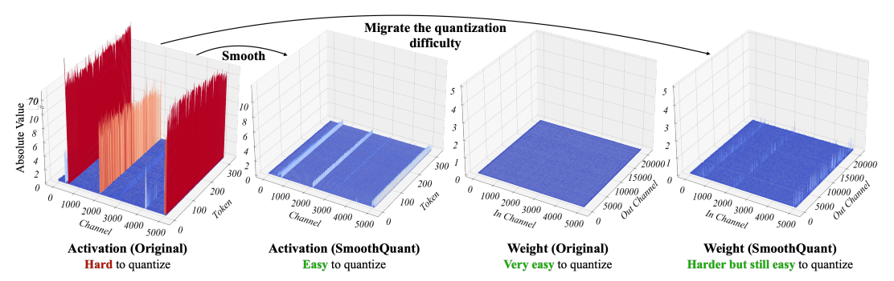

논문 [SmoothQuant: Accurate and Efficient Post-Training Quantization for Large Language Models]('https://arxiv.org/abs/2211.10438') 를 바탕으로 작성되었습니다.

## LLM Quantization의 어려움
LLM(Large Language Model)의 경우 아래와 같은 특징이 있다.
* Weight는 대체로 균등하고 고루 분포하는 형상을 가진다.
* Activation의 outliers는 다른 값들보다 ~100배 까지의 큰 차이를 가진다.
* Activation에서 outlier가 발생하는 Channel은 대체로 일정하다.

이는 per-channel quantization으로 어느정도 해결이 가능하지만 하드웨어 특성상 해당 연산은 비효율적이다.
('per-channel activation quantization does not map well to hardware-accelerated GEMM kernels.' 라고 적혀 있는데 자세히는 잘 모르겠지만 한번에 병렬 연산이 안되기 떄문인 것 같다.)

## 아이디어

위 그림과 같이 기존 Activation은 특정 channel에서 큰 값을 가지는 특징이 있다.
반면에 weight는 대체로 평탄하게 분포하는 것을 볼 수 있다.
위 상태로 Quantization을 진행하게 된다면 Activation의 소수 Channel 때문에 min max 값의 차이는 커져 Quantization Error 역시 커지게 된다.
그래서 Activation에서 큰 값을 지니는 Channel들의 값을 작게 만드는 대신 Weight에서 해당 Channel과 연산에 관여하는 부분을 약간 크게 만들어 Quantization을 진행하는 방법이다.
줄어들은 Activation은 min max 차이가 줄어들어 Quantization Error가 줄어들게 되고 Weight는 min max 차이가 증가하지만 기존 Activation에서 발생한 Error에 비해 크지 않아 효율이 더 좋아진다.

## 방법
