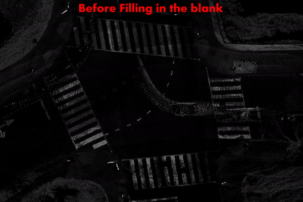
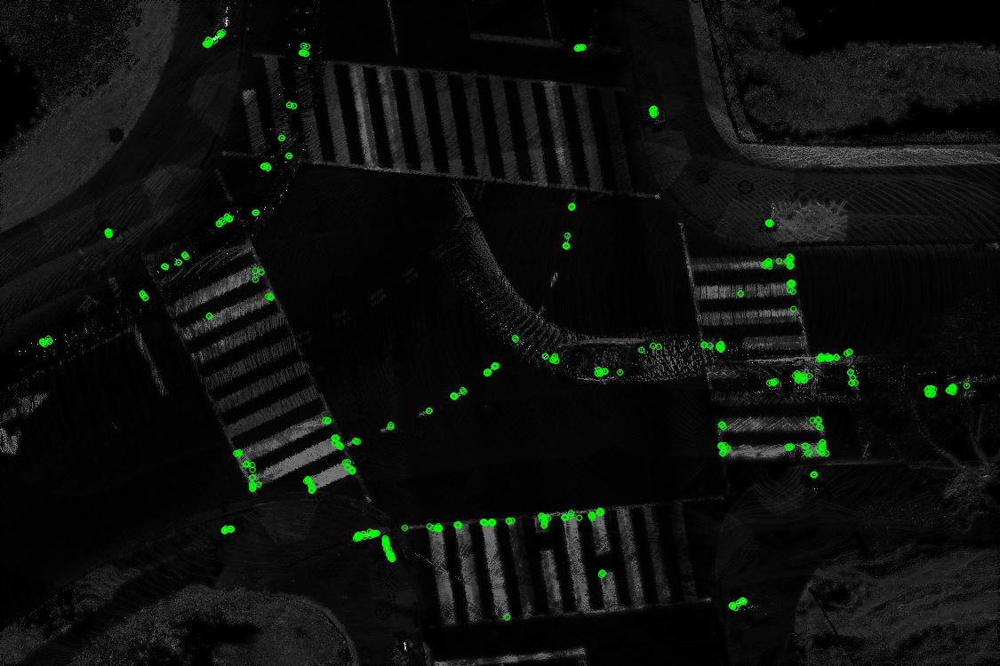
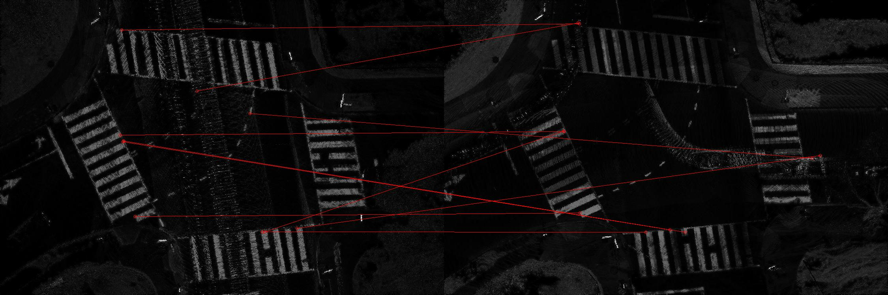
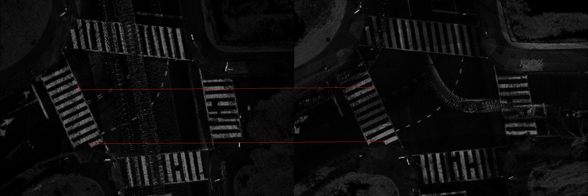

### 1. Bird's Eyes View
카메라 이미지를 Point Cloud 데이터에 Projection 하였을 때 오차가 발생한다. 따라서 조금 더 정확한 이미지로 Feature Detection을 하기 위해 Point Cloud 데이터를 Bird's Eyes View 이미지로 만들도록 하였다. Point Cloud는 Sparse한 특성을 가지고 있기 때문에 이미지 형태로 변환할 때 비어있는 Pixel에 대해 주변 값들의 평균을 내어 값을 채워주었다. 

사실 도로 위에 촬영 당시 지나가던 자동차와 행인등 여러가지 Noise가 존재하기 때문에 Worm's Eyes View로 제작하려 하였지만 동일 Pixel값을 가지는 Points중 가장 작은 z좌표를 가지는 포인트를 채택하는 방법은 큰 연산량을 요구하여서 조금 더 최적화가 필요할 것 같다.

또한 x, y 좌표가 Pixel로(integer) Quantization되기 때문에 어느정도 오차를 감수해야 한다. 이를 보완하는 방법 역시 생각해야 할 것 같다.

### 2. Feature Detection
FAST(Features from Accelerated Segment Test) 알고리즘과 BIREF(BInary Robust Independent Elementary Features) 알고리즘을 합친 ORB(Oriented FAST and Rotated BIREF) 알고리즘을 이용하여 Feature Detection을 수행한다.

Edge가 아닌 부분도 Feature로 검출된 것을 볼 수 있다. Point Cloud의 Sparse한 특성으로 도로 노면에 존재하는 모든 

### 3. Feature Matching
서로 다른 시간에 동일한 공간을 촬영한 측위 오차가 존재하는 Point Cloud의 BEV 이미지에 ORB를 이용해 추출한 Feature들을 서로 Matching하였다. 

Top 10의 Matching중 유효한 Matching은 2개 뿐이었다. 아마 위에서 언급한 이유로 잘못된 Feature들이 검출되기 때문인 것 같다.
