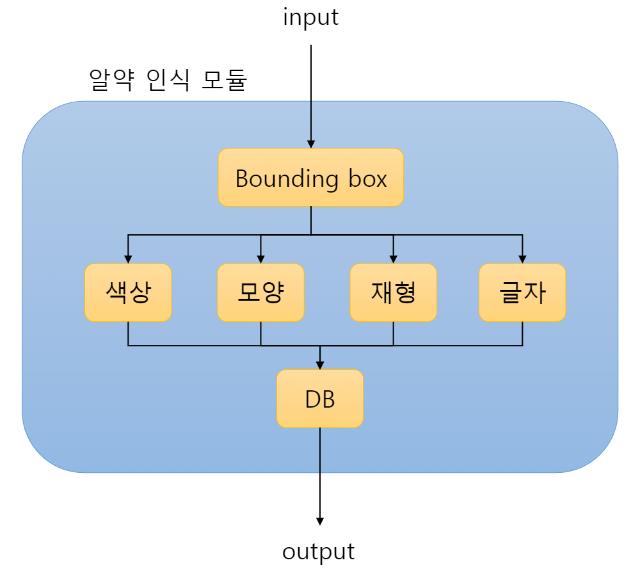

사진을 통해 알약 정보를 제공하는 프로젝트를 진행하기 앞서 알약 종류를 인식하는 모델을 개발합니다.

# 기획

## 데이터

[의약품 안전 나라 공공 데이터](https://nedrug.mfds.go.kr/pbp/CCBGA01/getItem?totalPages=4&limit=10&page=2&&openDataInfoSeq=11)

위 데이터를 보면 우리가 사용할만한 데이터는 각 알약의 종류마다 앞, 뒤가 찍혀있는 한장의 이미지와 색, 재형, 텍스트 등의 정보가 있네요.
이를 활용하여 알약의 종류를 판별하는 모델을 구현해보죠.

## 모델 구조

초반에는 하나의 모델로 알약의 종류를 식별하는 방법을 생각했어요.
하지만 이 방법은 몇 가지 문제가 있더라구요.

* 먼저 구별해야하는 종류가 너무 많다는 것이에요.  
우리는 약 25,000개의 종류를 구별해야 하는데, 각 알약마다 사진은 한장밖에 제공이 되지 않아요.
즉 augmentation을 통해 학습 데이터를 늘린다고 하더라도 쉽지 않을 것 같더라구요.

* 또 확장성의 문제가 있어요.  
하나의 모델로 이루어진 모듈은 새로운 알약이 등장할 때 마다 학습을 시켜야 한다는 문제가 발생합니다.
앞으로 셀 수 없을 정도로 신약이 꾸준히 등장할텐데 이 방법은 지속적인 서비스를 불가능하게 만들 거에요.

그래서 두 문제를 해결할 수 있는 방식을 선택할거에요.
바로 한번에 알약을 구별하는 것이 아닌, 알약의 특징등을 구별하고 이를 활용하여 최종적인 추론을 진행할거에요.
즉 여러개의 서브 모듈로 하나의 큰 알약 식별 모델을 구현하는 방식이죠.
필요한 서브모듈은 아래와 같습니다.

* Bounding Box  
먼저 우리는 입력으로 받은 사진에 대해 어디에 알약이 존재하는지 Box의 형태로 위치를 파악하는 모듈을 만들 거에요.
이를 활용해서 이미지를 crop하고 다음 모듈들에 입력으로 전달해 줄 것입니다.

* Color Classifier  
앞서 crop된 이미지를 통해 우리는 알약의 색을 구별할거에요.
(빨간색, 파란색, 노란색, ... 등)
이는 어려운 작업이 아니기 때문에 간단한 CNN 모델로 구현이 될 것 같습니다.

* Shape Classifier  
똑같이 crop된 이미지를 통해 알약의 모양을 구별할거에요.
(원형, 타원형, 오각형, ... 등)
이 작업은 사실 Bounding Box 파악하는 모델로 한꺼번에 진행할 수 있을 것 같아요.
YOLO 모델을 활용하여 Class를 알약의 모양으로 두고 detection하는 방식으로 통합할 수 있겠네요.

* Fomulation Classifier  
알약의 재형이라는 특징도 구별해 볼거에요.
재형이라 함은 알약이 캡슐로 이루어 졌는지, 코팅이 되어있는지 등과 같은 알약의 질감과 같은 복합적인 특징이네요.

* Text Recognition  
솔직히 가장 걱정되는 모듈입니다.
알약 위에 글자가 프린팅 되어있는 형태도 있고, 알약 안쪽으로 파고 들어 음영으로 글자가 쓰여져 있는 형태도 있어요.
그리고 데이터가 25,000개 라고 하지만 모든 알약에 글씨가 있는 것도 아니고 글자도 다 다르거든요.
그래서 우리는 위에서 구한 색, 모양, 제형으로 추정되는 알약의 후보군을 생성하고,
후보군의 텍스트와 인식한 텍스트의 유사성을 판단하는 방식으로 최종 결정을 내리려고 합니다.

사실 위 방식은 어느 하나의 특징이라도 잘못 인식하면 아예 다른 종류의 알약으로 결정을 내릴 수 있다는 문제가 있어요.
이를 해결하기 위한 솔루션은 일단 초기 프로토타입을 구현하고 난 후에 생각해 봅시다.

