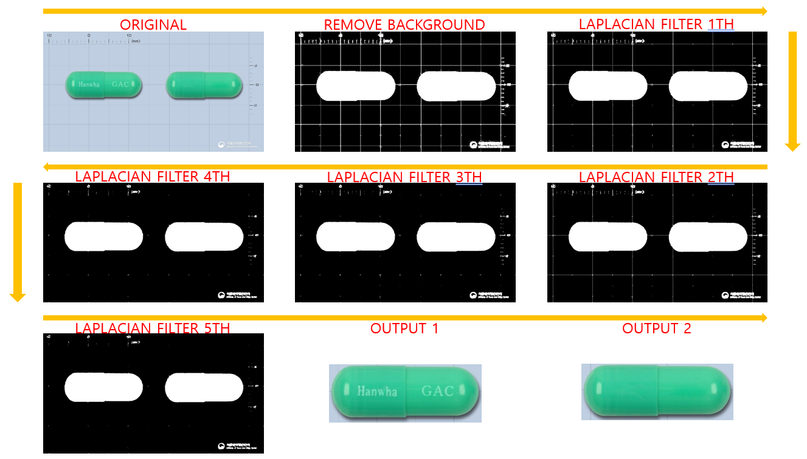
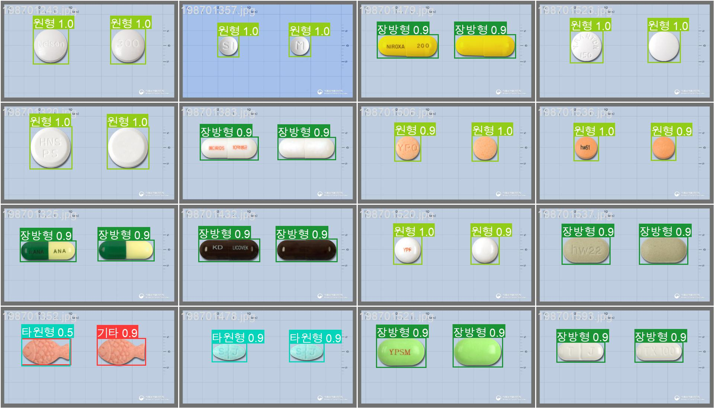
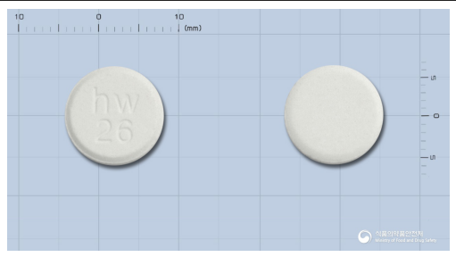
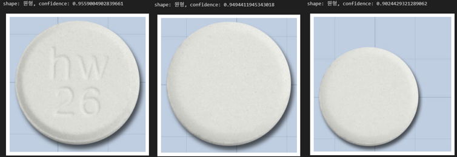
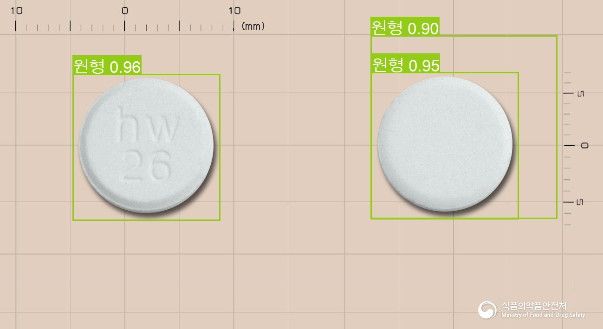

사진으로부터 알약을 찾고 형태를 분류하는 모듈을 만들거에요.

# 초기 개발

우리는 Yolo v8이라는 훌륭한 탐지 모델을 사용할 것입니다.
그 전에 먼저 학습 데이터를 생성 해야겠죠?

## 데이터 생성

우리는 잘 정제된 알약 사진에서 알약의 위치를 Box의 형태로 생성해야 합니다.

일단 먼저 배경을 제거하는 작업을 시작할까요?
이미지의 픽셀중 가장 많이 나타나는 RGB값을 이용하여 배경색을 구했어요.
이제 이미지에서 해당 RGB와 오차범위(3) 안쪽에 있는 값을 가지는 픽셀들을 전부 제거하고 남은 부분을 볼거에요.

```python
# get background color
most_b = get_most_value(img[:,:,0])
most_g = get_most_value(img[:,:,1])
most_r = get_most_value(img[:,:,2])
bg_bgr = np.array([most_b, most_g, most_r])

# filter background
background = cv2.inRange(img, bg_bgr-3, bg_bgr+3)
filtered = background + 1
filtered[filtered > 0] = 255
shape = img.shape
```

배경을 제거하니 알약, 알약 크기와 정보 출처에 관한 텍스트, 그리고 격자 무늬가 남아있네요.
일단 무늬를 제거하는 코드를 만들어 봅시다.
격자를 제거하기 위해 edge를 표시해주는 Laplacian Filter를 이용할게요.
그런데 격자 무늬가 1~5px로 두꺼운 사진도 있기 때문에 이 과정을 5번 정도 반복해서 완전히 제거합시다.

```python
# filter edges
for i in range(5):
    edges = cv2.Laplacian(filtered, cv2.CV_8U, ksize=3)
    edges[:shape[0]-1,:shape[1]-1] = edges[1:,1:]
    filtered[edges>0] = 0
``` 

격자를 제거하고 나니 알약의 형태와 몇몇 텍스트만 남았네요.
이제 외곽선을 검출하는 함수인 `findContours`를 이용하여 남은 객체들의 대략적인 형태를 가져오죠.
그런데 우리가 관심있는 부분은 알약뿐 텍스트에 대해서는 필요가 없어요.
그래서 검출된 외곽선의 넓이와 높이를 구해 일정 크기가 넘지 않으면 제거해서 알약만 남겨봅시다.

```python
# get contorus
contours, _ = cv2.findContours(filtered, cv2.RETR_EXTERNAL, cv2.CHAIN_APPROX_SIMPLE)

# filter contorus
boxes = []
threshold = 100 # minimum width & height
for contour in contours:
    min_x = np.min(contour[:,:,0])
    max_x = np.max(contour[:,:,0])
    min_y = np.min(contour[:,:,1])
    max_y = np.max(contour[:,:,1])
    width = max_x - min_x + 5 # correction for laplacian filter
    height = max_y - min_y + 5 # correction for laplacian filter
    
    if width >= threshold and height >= threshold:
        # center_x, center_y, width, height
        boxes.append([(min_x+max_x)/2, (min_y+max_y)/2, width, height])
```

위 좌표를 이용해서 알약이 어느 위치에 있는지 우리는 알 수 있게 되었어요.



## 학습

[train YOLOv8 on custom dataset](https://learnopencv.com/train-yolov8-on-custom-dataset/)

우리는 YOLO를 사용하여 학습 및 추론을 진행 해볼게요.
먼저 전에 생성한 데이터를 각각 train, test, validation 으로 나눠줍시다.
그리고 학습을 위해 데이터 위치와 Class에 대한 정보를 .yaml 파일로 생성하여 학습에 대한 메타 데이터를 표시할 것입니다.

```yaml
# pill.yaml
path: ./
train: train/
val: val/

nc: 11

# Classes
names:
  0: '기타'
  1: '마름모형'
  2: '반원형'
  3: '사각형'
  4: '삼각형'
  5: '오각형'
  6: '원형'
  7: '육각형'
  8: '장방형'
  9: '타원형'
  10: '팔각형'
```

데이터의 폴더 구조는 아래와 같이 있어야 해요.
```
|-- train
|   |-- images
|       |-- 199101028.jpg
|       |-- 199101035.jpg
|   |-- labels
|       |-- 199101028.txt
|       |-- 199101035.txt
|-- val
|   |-- images
|       |-- 195900032.jpg
|       |-- 195900043.jpg
|   |-- labels
|       |-- 195900032.txt
|       |-- 195900043.txt
```

label.txt의 내용은 `class_num center_x center_y width height`의 형태를 가져야 합니다.
```
8 0.7286374133949192 0.4421720733427362 0.34026173979984603 0.2397743300423131
8 0.27251732101616627 0.4421720733427362 0.3394919168591224 0.24259520451339917
```

이제 관련된 패키지를 설치하고 학습을 진행해보죠

```shell
$ pip install ultralytics
```

```shell
$ yolo task=detect mode=train model=yolov8n.pt imgsz=640 data=pill.yaml epochs=10 batch=8 name=yolov8n_pill
```

음 약 2시간 정도 기다렸더니 뭔가 폴더가 만들어 졌어요.
안에 내용을 확인하니 score에 대한 그래프, validation 결과, best와 last 모델 weight 등이 저장되어 있네요.



학습 과정에서 validation dataset을 이용하여 진행한 평가의 일부 결과입니다.
대충 어느정도 예측이 잘 진행되는데, 왼쪽 아래 붕어빵 모양 알약은 틀리게 예측되는 것도 있네요.
아무튼 이런 방식으로 학습을 진행하면 될 것 같아요.

## 추론

학습된 모델을 활용해서 직접 test dataset을 활용하여 추론하는 과정을 연습해보죠.

우리는 학습된 모델을 불러올 것이에요.
```python
from ultralytics import YOLO
model = YOLO("runs/detect/yolov8n_shape/weight/best.pt").cuda()
```

테스트 해볼 이미지도 함께 불러봅시다
```python
import matplotlib.pyplot as plt

def imshow(img):
    plt.imshow(img)
    plt.axis('off')
    plt.show()

img_path = 'test/images/197600554.jpg'
img = plt.imread(img)
imshow(img)
```



그럼 이제 모델을 이용해서 예측을 해보죠.
```python
results = model.predict(img)  # predict on an image

for result in results:
    names = result.names
    boxes = result.boxes
    for box in boxes:
        pred = box.cls
        conf = box.conf
        print(f'shape: {names[pred.item()]}, confidence: {conf.item()}')
        
        xyxy = box.xyxy
        min_x = round(xyxy[0][0].item())
        min_y = round(xyxy[0][1].item())
        max_x = round(xyxy[0][2].item())
        max_y = round(xyxy[0][3].item())
        imshow(img[min_y:max_y,min_x:max_x])
```





분명 이미지 속 알약은 둘인데 3개의 알약이 감지 되었네요.
사실 깔끔한 이미지만을 이용하여 학습을 하는 것은 일반적인 상황에서 실용적이지 못할 것이라고 에상은 했어요.
그래서 이 모듈을 더욱 개선시키기 위해서는 이미지를 회전하고, 이동시켜보고, 배경도 바꾸는 식의 Augmentation을 해야 할 것입니다.