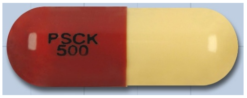
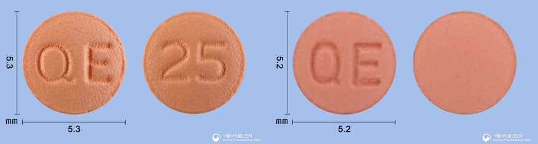

# 초기  개발

## 유사도 측정

후보군의 텍스트와 예측한 결과 텍스트의 유사도를 측정하기 위해 두 가지 기준을 사용할 거예요.  
* Jaccard Similarity : 두 집합 간의 교집합과 합집합의 비율을 계산하여 유사도를 측정하는 방식  
```python
import distance
t1 = 'compliment'
t2 = 'complement'
print(distance.jaccard(t1, t2)) 
# output : 0.1111
t1 = 'naver'
t2 = 'kakao'
print(distance.jaccard(t1, t2)) 
# output : 0.8571
t1 = 'hanyang univ'
t2 = 'SNU'
print(distance.jaccard(t1, t2)) 
# output : 1.0
```
* Levenshtein Distance : 두 텍스트를 서로 같게 만들기 위해 필요한 최소 편집(삽입, 삭제, 대체)
```python
import nltk
t1 = 'compliment'
t2 = 'complement'
print(nltk.edit_distance(t1, t2)) 
# output : 1
t1 = 'naver'
t2 = 'kakao'
print(nltk.edit_distance(t1, t2)) 
# output : 4
t1 = 'hanyang univ'
t2 = 'SNU'
print(nltk.edit_distance(t1, t2))
# output : 12
```

Jaccard Similarity와 Levenshtein Distance는 두 텍스트가 유사할수록 낮은 값을 가지도록 되어 있어요.
하지만 Levenshtein Distance는 하나의 텍스트가 길면 길수록 한없이 커진답니다.
그래서 우리는 길이가 더 긴 텍스트 쪽으로 normalization을 해 줄 것입니다.

```python
def normed_leven_dist(t1, t2):
    max_size = max(len(t1), len(t2))
    return nltk.edit_distance(t1, t2) / max_size

print(normed_leven_dist('compliment', 'complement')) 
# output : 0.1
print(normed_leven_dist('naver', 'kakao')) 
# output : 0.8
print(normed_leven_dist('hanyang univ', 'SNU')) 
# output : 1.0
```

이제 두 값을 모두 사용하기 때문에 두 값을 곱해서 확률로 만들어 줍시다.
우리가 원하는 것은 유사도를 얻는 것이기에 유사성이 높을수록 1에 가까워야 맞겠죠?
곱한 결과를 1에서 빼주는 형태로 구현하면 되겠네요.

```python
def get_similarity(t1, t2):
    max_len = max(len(t1), len(t2))
    leven_dist = nltk.edit_distance(t1, t2) / max_len
    jaccard_sim = distance.jaccard(t1, t2)
    return 1 - leven_dist * jaccard_sim

print(get_similarity('compliment', 'complement')) 
# output : 0.9888
print(get_similarity('naver', 'kakao')) 
# output : 0.31428
print(get_similarity('hanyang univ', 'SNU')) 
# output : 0.0
```

사실 위 두 함수는 구현하는 것이 어렵지 않고 제가 의존성을 추가하는 것을 별로 좋아하지 않지만,
많은 후보군과 비교를 위해서 최적화가 되어있는 라이브러리를 사용했어요.
뭐 최적화가 잘 되어 있는지는 나중에 비교를 해보는 것으로 하죠.

## 학습

학습 데이터를 생성하기 위해서 [deep-text-recognition-benchmark](https://github.com/clovaai/deep-text-recognition-benchmark) 레포를 따를 것입니다.  
일단 위 레포를 clone 합시다!

먼저 우리는 아래와 같은 폴더 구조로 데이터를 가지고 있어요.
```
|-- data
|   |-- train
|       |-- gt.txt
|       |-- boxes
|           |-- 200900695_0.jpg
|           |-- ...
|   |-- val
|       |-- gt.txt
|       |-- boxes
|           |-- 195900027_0.jpg
|           |-- ...
```
```
# gt.txt
200900695_0.jpg	AL
...
```

자 이제 deep-text-recognition-benchmark/create_lmdb_dataset.py 코드를 통해 데이터셋을 생성할 거예요.
그런데 create_lmdb_dataset.py 코드에서 약간 수정할 부분이 있어요.
```python
# create_lmdb_dataset.py
def createDataset(inputPath, gtFile, outputPath, checkValid=True):
    """
    Create LMDB dataset for training and evaluation.
    ARGS:
        inputPath  : input folder path where starts imagePath
        outputPath : LMDB output path
        gtFile     : list of image path and label
        checkValid : if true, check the validity of every image
    """
    os.makedirs(outputPath, exist_ok=True)
    env = lmdb.open(outputPath, map_size=1024000000) # <- 여기서 map size를 데이터 크기에 따라 조절 하세요!
    cache = {}
    cnt = 1
```

이제 train, val 데이터로 학습에 사용할 lmdb 데이터를 생성합시다.
```sh
$ python deep-text-recognition-benchmark/create_lmdb_dataset.py --inputPath data/train/boxes --gtFile data/train/gt.txt --outputPath data/train/lmdb
$ python deep-text-recognition-benchmark/create_lmdb_dataset.py --inputPath data/val/boxes --gtFile data/val/gt.txt --outputPath data/val/lmdb
```

자 lmdb 데이터도 생성이 되었겠다, 학습을 시작합니다.
여러가지 파라미터들이 존재하는데 모델에 관련한 몇몇 파라미터와 예측에 사용할 문자들을 한정해주어 학습을 진행할 거예요.
```sh
python deep-text-recognition-benchmark/train.py --train_data data/train/lmdb --valid_data data/val/lmdb --Transformation TPS --FeatureExtraction ResNet --SequenceModeling BiLSTM --Prediction Attn --select_data '/' --batch_ratio 1 --workers 0 --batch_size 128 --character '&+-./0123456789ABCDEFGHIJKLMNOPQRSTUVWXYZabcdefghiklmnoprstuvwxyz'
```

폴더가 하나 새로 생겼죠?
로그도 있고 best_accuracy.pth, best_norm_ED.pth가 있어요.
norm_ED는 normalized edit distance라고 하네요.
위에서 사용했던 'Levenshtein Distance'의 normalized 버전이 아닐까 생각이 듭니다.

## 테스트

이제 학습된 모델을 불러와서 추론하는 것을 살펴봅시다.
```python
import easyocr
import matplotlib.pyplot as plt

def show_img(img_path):
    plt.imshow(plt.imread(img_path))
    plt.axis('off')  # Optional: to hide the axis
    plt.show()

img_path = '196000001_0.jpg'
show_img(img_path)

reader = easyocr.Reader(['en'], user_network_directory='../data')
print(reader.readtext(img_path))
```

'196000001_0.jpg' 이미지에 대해 텍스트 인식을 해보았어요.


```
[([[97, 61], [217, 61], [217, 97], [97, 97]], 'PSCK', 0.9858795404434204), ([[118, 90], [194, 90], [194, 122], [118, 122]], '500', 0.9943707547542567)]
```

위와 같이 리스트의 형태로 위치, 텍스트, 그리고 score가 함께 나오네요.
우리에게 필요한 것은 텍스트와 score!
score가 0.1만 되어도 정확하지 않지만 비슷한 모양의 텍스트가 나오더라구요.
그래서 일정 threshold 이상의 score가 나오면 결과에 포함시키는 형태로 모듈을 구현해 보았습니다.

```python
# text_reader.py
import easyocr

class TextReader():
    def __init__(self, model_path, threshold=0.1) -> None:
        self.reader = easyocr.Reader(['en'], user_network_directory=model_path)
        self.threshold = threshold
        
    def read(self, img):
        text = ''
        results = self.reader.readtext(img)
        for result in results:
            pred = result[1]
            conf = result[2]
            if conf > self.threshold:
                text += pred
        return text
```

이제 위 모듈을 이용하여 정확도를 평가할 생각입니다.
우리는 인식할 문자를 어느정도 한정하여 학습을 진행했지만, 사실 프린팅된 텍스트가 아닌 문자를 정확하게 인식하는 것은 쉽지 않습니다.
그래서 예측한 텍스트와 정확히 일치하는 알약을 찾는 방법이 아닌, 다른 특징들로 좁혀진 후보군 중 가장 유사한 텍스트를 가진 알약을 선정하는 방법으로 접근할 거예요.
텍스트 인식 모듈 단일 테스트기 때문에 색, 모양은 테스트 하려는 알약의 데이터를 그대로 사용하고 텍스트만 예측한 값을 사용하는 식으로 진행할게요.

```python
def predict_by_feats(db, shape, color, text, k=5):
    candidates = db[db['의약품제형']==shape]
    candidates = candidates[(candidates['색상앞']==color) | (candidates['색상뒤']==color)]
    
    cand_probs = []
    for _, row in candidates.iterrows():
        text_front = preprocess_text(row['표시앞'])
        text_back = preprocess_text(row['표시뒤'])
        cand_probs.append(max(get_similarity(text_front, text), get_similarity(text_back, text)))
    
    cand_probs = np.array(cand_probs)
    best_idx = cand_probs.argmax()
    return candidates.iloc[best_idx]['품목일련번호']
```

이렇게 만들어서 테스트를 해보았더니, 결과가 처참하더라구요.
나름대로 원인을 좀 분석해보니 아래와 같은 문제점이 보였습니다/



위 두 알약은 모양도, 색도, 텍스트도 동일해요.
사람의 눈으로 자세히 보면 비교할 수 있지만, 우리가 가진 특징 만으로 컴퓨터가 판단하긴 어려워 보여요.
그래서 하나의 결과만 던져주는 방법이 아닌, 가장 근접한 N개의 결과를 던져주고 유저가 자신의 알약과 가장 비슷한 약을 고르도록 가이드를 제시할 거예요.
그렇기 때문에 우리는 텍스트 인식 모듈의 정확도를 측정할 때, N개의 결과 중에 답이 존재한다면 옳은 예측이라 판단합시다.
```python
def predict_by_feats(db, shape, color, text, k=5):
    candidates = db[db['의약품제형']==shape]
    candidates = candidates[(candidates['색상앞']==color) | (candidates['색상뒤']==color)]
    
    cand_probs = []
    for _, row in candidates.iterrows():
        text_front = preprocess_text(row['표시앞'])
        text_back = preprocess_text(row['표시뒤'])
        cand_probs.append(max(get_similarity(text_front, text), get_similarity(text_back, text)))
    
    cand_probs = np.array(cand_probs)
    top_k = cand_probs.argsort()[-k:]
    results = [candidates.iloc[i]['품목일련번호'] for i in top_k]
    return results
```

```
valid predictions: 317, num data: 751, accuracy: 42.2103861517976
```

Top N개를 선정하는 방식도 정확도가 그리 좋지만은 않네요.
아마 텍스트간 유사성을 구하는 부분에서 문제가 있는 것 같아요.

```python
print(get_similarity('atlck', 'at|ck'))
print(get_similarity('atck', 'at|ck'))
```

```
0.93
0.96
```

위 예시를 보면 첫 번째 경우는 '|'과 'l'을 단순히 잘못 예측한 경우에요.
두 문자는 자세히 보지 않으면 실제 세상에서도 다르지 않아 보일 정도로 유사합니다.
그래서 두 번째 경우처럼 아예 '|'를 인식하지 못하는 경우보다 점수가 더 높아야 한다고 생각해요.
하지만 우리가 구현한 방식은 두 번째 경우를 더 높은 확률로 인식하였네요.
어쩌면 모듈을 개선하는 방법은 더 정밀한 모델을 만드는 방법 보다 뛰어난 유사성 알고리즘을 찾는 것이,
큰 차이로 성능을 높일 수 있을 것 같아요.